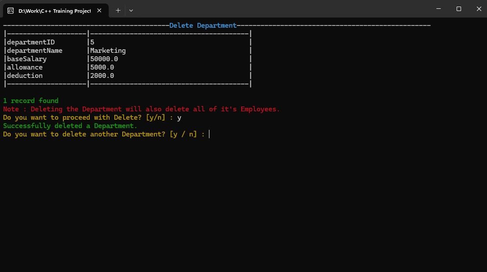

# Employee Database

#### This is a C++ Based Console App which can be used as an Employee Database.

# Steps to run the project in your local machine

1. `Install Visual Studio with C++ Development config.` [download link](https://visualstudio.microsoft.com/downloads/)

2. `Clone this repository.`

3. `Run install_sqlite.bat either by double clicking it or by running it from the terminal to install sqlite3.`

4. `Open the Solution in Visual Studio using Employee Database.sln file`

5. `Now, you can build and run the main project as well as the test project.`

## Functionalities

- User can Create Tables in the Database with their relationships.

- User can delete a created Table.

- User can Insert data into Department, Engineer, Finance, HR, QA, Manager Tables.

- User can Update the data from Department, Engineer, Finance, HR, QA, Manager Tables.

- User can Delete the data from Department, Engineer, Finance, HR, QA, Manager Tables.

- User can Backup Database in CSV Files. Selective export of Tables is also supported.

## Database Schema

## Tech Stack

- `C++ 17` for writing business logic as well as the View part of the Console.

- [SQLite Database](https://www.sqlite.org/) for storing Tables and Data.

- [gTest/gMock](https://google.github.io/googletest/) for Unit Testing.

- [Logician (Custom Logging Library)](https://github.com/raj17ce/Logician) for logging all the executed queries.

## ScreenShots

 

